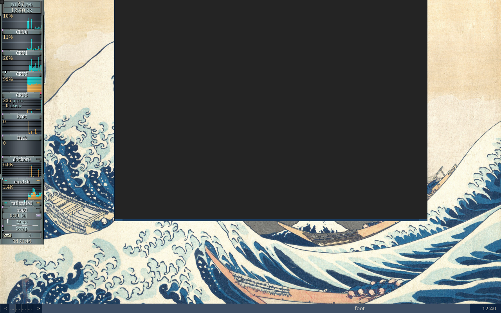
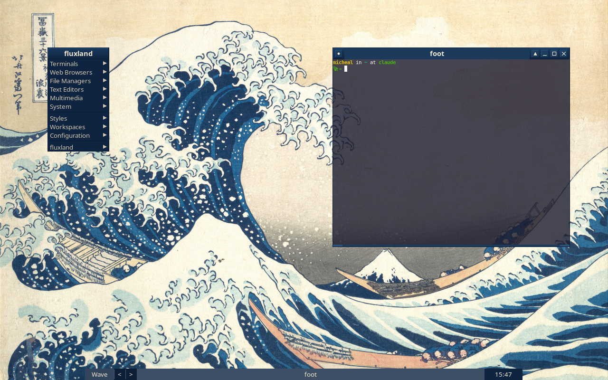
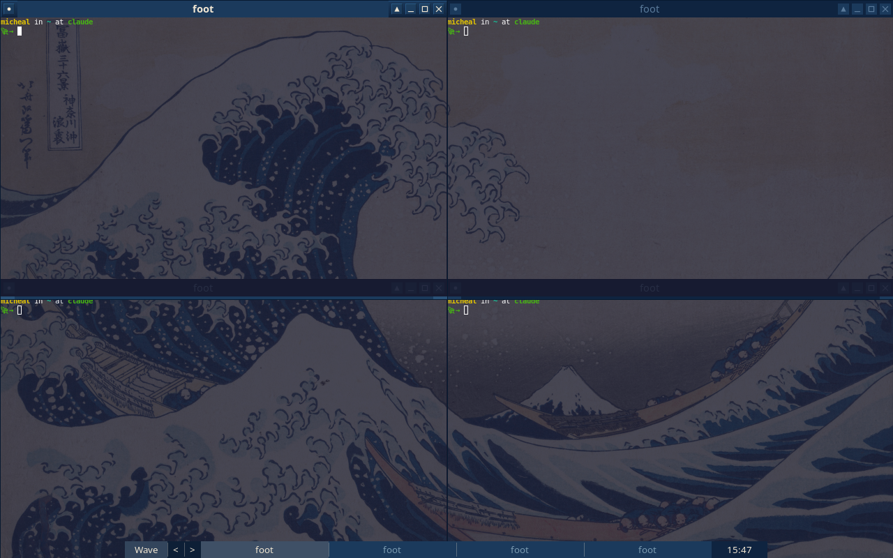

# fluxland

A lightweight, highly configurable Wayland compositor inspired by [Fluxbox](http://fluxbox.org/).

[](https://github.com/ecliptik/fluxland/actions)
[](LICENSE)
[](https://github.com/ecliptik/fluxland/releases)

---

[About](#about) | [Screenshots](#screenshots) | [Quick Start](#quick-start) | [Features](#features) | [Dependencies](#dependencies) | [Building](#building) | [Configuration](#configuration) | [Migration from Fluxbox](#migration-from-fluxbox) | [IPC](#ipc) | [Man Pages](#man-pages) | [Contributing](#contributing) | [License](#license)

---

## About

fluxland brings the Fluxbox experience to the [Wayland](https://wayland.freedesktop.org/) display protocol. For
years, Fluxbox has been the window manager of choice for users who value
simplicity, speed, and deep configurability. As the Linux desktop ecosystem
transitions from X11 to Wayland, fluxland provides a familiar home for
Fluxbox users while embracing modern display server capabilities.

This project was 100% vibe coded using [Claude Code](https://docs.anthropic.com/en/docs/claude-code)
with [Claude Code Teams](https://docs.anthropic.com/en/docs/claude-code/teams) orchestration.
[Read about how it was built](docs/DEBRIEF.md) — from Fluxbox nostalgia to a working Wayland
compositor in 6 days.

Built on [wlroots](https://gitlab.freedesktop.org/wlroots/wlroots) 0.18, fluxland implements 30+ Wayland protocols and delivers
first-class support for server-side decorations with Fluxbox theme
compatibility, key chains and modal keybindings, window tabbing, a configurable
toolbar with icon bar, the slit (dockapp container), and per-window rules. It
reads Fluxbox configuration files directly, making migration straightforward.

fluxland targets users who want a fast, keyboard-driven stacking compositor
with the depth of configuration that Fluxbox is known for, without sacrificing
the benefits of a modern Wayland session.

## Screenshots

*[Great Wave](https://en.wikipedia.org/wiki/The_Great_Wave_off_Kanagawa) theme with ocean blue decorations and [Hokusai](https://en.wikipedia.org/wiki/Hokusai) wallpaper.*

| | |
|---|---|
|  |  |
| Desktop with wallpaper | Single window with [gkrellm](http://gkrellm.srcbox.net/) in slit (XWayland) |
|  |  |
| Root menu | Grid arrangement (4 windows) |

See [`examples/`](examples/) for themes and complete configuration examples.

## Quick Start

1. **Install dependencies** (see [Dependencies](#dependencies) below) and build:

   ```sh
   meson setup build && ninja -C build
   sudo ninja -C build install
   ```

   For distro-specific instructions, see [`docs/QUICKSTART.md`](docs/QUICKSTART.md).

2. **Copy the example configuration:**

   ```sh
   mkdir -p ~/.config/fluxland
   cp /path/to/fluxland/data/* ~/.config/fluxland/
   chmod +x ~/.config/fluxland/startup
   ```

   Or start from a themed example (see [`examples/`](examples/)):

   ```sh
   cp -r /path/to/fluxland/examples/wave-desktop/* ~/.config/fluxland/
   chmod +x ~/.config/fluxland/startup
   ```

3. **Start the compositor** from a TTY or from within another compositor:

   ```sh
   fluxland
   ```

4. **Essential keybindings:**

   | Key | Action |
   |---|---|
   | `Mod4+Return` | Open terminal ([foot](https://codeberg.org/dnkl/foot)) |
   | `Mod4+d` | Application launcher ([wofi](https://hg.sr.ht/~scoopta/wofi)) |
   | `Mod4+Shift+q` | Close focused window |
   | `Mod4+f` | Toggle fullscreen |
   | `Mod4+m` | Toggle maximize |
   | `Mod4+1`..`9` | Switch to workspace |
   | `Mod4+Shift+1`..`9` | Send window to workspace |
   | `Alt+Tab` | Cycle windows |
   | `Mod4+r` | Reload configuration |
   | `Mod4+Shift+e` | Exit compositor |

   `Mod4` is the Super/Windows key.

## Features

- **Server-side decorations** with full Fluxbox theme/style support (gradients, textures, fonts, colors)
- **Key chains** -- multi-key sequences (e.g. `Mod4+x Mod4+t` to launch a terminal)
- **Keymodes** -- modal keybinding sets (e.g. a resize mode with vim-style movement keys)
- **Window tabbing** -- group windows into tabbed containers, drag-to-tab from titlebars
- **Toolbar** with workspace switcher, icon bar, and clock; configurable placement and auto-hide
- **Slit** -- dock area for [Window Maker](https://www.windowmaker.org/) dockapps and other dockable applications (e.g. gkrellm via XWayland)
- **Root menu and window menu** -- Fluxbox-compatible menu definitions with submenus, separators, and built-in entries
- **Per-window rules** -- match by app_id, title, or class with regex; set workspace, dimensions, position, decorations, layer, transparency, and more
- **Auto-grouping** -- automatically tab windows matching specified patterns
- **MacroCmd / ToggleCmd** -- combine multiple actions in a single binding or cycle between them
- **Mouse bindings** -- per-context (titlebar, desktop, border, grip) with click, drag, and double-click support
- **Multiple focus policies** -- click-to-focus, sloppy (mouse focus), strict mouse focus
- **Smart window placement** -- row-smart, column-smart, cascade, and under-mouse placement policies
- **Workspace management** -- up to 32 named virtual desktops with edge warping
- **XKB keyboard layout** -- full XKB configuration with multi-layout support and runtime switching
- **IPC** via Unix socket with JSON protocol; includes `fluxland-ctl` command-line client
- **Event subscriptions** -- subscribe to window, workspace, and output events for scripting
- **XWayland support** -- run X11 applications alongside native Wayland clients
- **Live reconfiguration** -- reload all config files at runtime (keys, apps, menu, style, init) via `Mod4+r` or `SIGHUP`
- **30+ Wayland protocols** including:
  - xdg-shell, xdg-decoration, layer-shell, session-lock
  - fractional-scale, tearing-control, content-type, presentation-time
  - pointer-constraints, relative-pointer, pointer-gestures
  - virtual-keyboard, virtual-pointer, text-input, input-method
  - gamma-control, output-management, output-power, screencopy
  - data-control, xdg-activation, xdg-foreign, tablet-v2
  - cursor-shape, viewporter, single-pixel-buffer, alpha-modifier
  - security-context, linux-dmabuf, idle-notify, idle-inhibit

## Dependencies

### Build dependencies

| Dependency | Debian/Ubuntu | Arch |
|---|---|---|
| meson (>= 0.60) | `meson` | `meson` |
| ninja | `ninja-build` | `ninja` |
| C17 compiler | `gcc` or `clang` | `gcc` or `clang` |
| wlroots 0.18 | `libwlroots-0.18-dev` | `wlroots0.18` |
| wayland | `libwayland-dev` | `wayland` |
| wayland-protocols (>= 1.32) | `wayland-protocols` | `wayland-protocols` |
| xkbcommon | `libxkbcommon-dev` | `libxkbcommon` |
| libinput (>= 1.14) | `libinput-dev` | `libinput` |
| pixman | `libpixman-1-dev` | `pixman` |
| pangocairo | `libpango1.0-dev` | `pango` |
| libdrm | `libdrm-dev` | `libdrm` |

### Optional dependencies

| Dependency | Debian/Ubuntu | Arch | Purpose |
|---|---|---|---|
| XWayland | `xwayland` | `xorg-xwayland` | X11 application support |
| xcb, xcb-ewmh, xcb-icccm | `libxcb1-dev libxcb-ewmh-dev libxcb-icccm4-dev` | `libxcb xcb-util-wm` | XWayland EWMH/ICCCM |

### Runtime companions (recommended)

- **foot** or another Wayland terminal emulator
- **wofi**, **[bemenu](https://github.com/Cloudef/bemenu)**, or **[fuzzel](https://codeberg.org/dnkl/fuzzel)** for application launching
- **[swaybg](https://github.com/swaywm/swaybg)** for wallpaper
- **[waybar](https://github.com/Alexays/Waybar)** for a status bar
- **[mako](https://github.com/emersion/mako)** or **[dunst](https://dunst-project.org/)** for notifications
- **[swayidle](https://github.com/swaywm/swayidle)** + **[swaylock](https://github.com/swaywm/swaylock)** for idle/lock management
- **[grim](https://sr.ht/~emersion/grim/)** + **[slurp](https://github.com/emersion/slurp)** for screenshots

## Building

```sh
meson setup build
ninja -C build
```

To install system-wide:

```sh
sudo ninja -C build install
```

### Build options

| Option | Type | Default | Description |
|---|---|---|---|
| `xwayland` | feature | auto | Enable XWayland support |
| `asan` | boolean | false | Enable address sanitizer |
| `ubsan` | boolean | false | Enable undefined behavior sanitizer |

Example with options:

```sh
meson setup build -Dxwayland=enabled -Dasan=true
ninja -C build
```

## Configuration

fluxland reads configuration from the first directory found:

1. `$FLUXLAND_CONFIG_DIR/`
2. `$XDG_CONFIG_HOME/fluxland/`
3. `~/.config/fluxland/`
4. `~/.fluxbox/` (Fluxbox compatibility fallback)

### Config files

| File | Format | Description |
|---|---|---|
| `init` | X resource (key: value) | Compositor settings: workspaces, focus policy, toolbar, placement, XKB layout |
| `keys` | Fluxbox keys format | Keyboard and mouse bindings, key chains, keymodes, macro/toggle commands |
| `apps` | Fluxbox apps format | Per-window rules: workspace, dimensions, position, decorations, layer, transparency, auto-grouping |
| `menu` | Fluxbox menu format | Root menu definition with exec entries, submenus, separators, styles directory, and built-in items |
| `style` | Fluxbox style format | Window decoration theme: titlebar, buttons, handle, grip, frame, menu, and toolbar colors/textures/fonts |
| `startup` | Shell script | Autostart script executed once at launch; use for wallpaper, bars, daemons |

All configuration can be reloaded at runtime with `Mod4+r` (Reconfigure action)
or by sending `SIGHUP` to the compositor process. Example configuration files
are provided in the `data/` directory.

See the man pages below for detailed format documentation.

## Migration from Fluxbox

### What works the same

- **Config file formats** -- `init`, `keys`, `apps`, `menu`, and `style` files use the same syntax as Fluxbox.
- **Key binding format** -- modifier and key names, action names, key chains, and keymodes are compatible.
- **Mouse bindings** -- same context names (OnTitlebar, OnDesktop, OnWindowBorder, etc.) and button syntax.
- **Per-window rules** -- same `[app]`/`[end]` block syntax with property matching and settings.
- **Themes** -- Fluxbox style files work directly; texture syntax (Raised, Flat, Gradient, etc.) is preserved.
- **Menu format** -- `[exec]`, `[submenu]`, `[separator]`, `[stylesdir]`, `[reconfig]`, `[exit]` entries.
- **Config directory** -- fluxland falls back to `~/.fluxbox/` if no fluxland config directory exists.

### What is different

- **Wayland-only** -- no X11 root window, no `xprop`/`xdotool`; use `fluxland-ctl` for IPC and scripting.
- **app_id replaces WM_CLASS** -- in `apps` rules, the `class` property matches the Wayland `app_id` (e.g. "firefox", "foot") rather than the X11 WM_CLASS.
- **No `screen0` at runtime** -- while `init` still uses `session.screen0.*` keys for compatibility, Wayland outputs are managed per-monitor via `wlr-output-management`.
- **Slit uses layer-shell** -- dockable applications use the Wayland layer-shell protocol instead of X11 docking.
- **Session lock** -- uses `ext-session-lock-v1` protocol; pair with `swaylock` instead of X11 lock programs.
- **XWayland is optional** -- X11 apps work through XWayland when enabled at build time, but native Wayland clients are preferred.

## IPC

fluxland provides a Unix socket IPC interface with JSON messages. The
`fluxland-ctl` command-line tool handles socket discovery and message
formatting.

### Examples

```sh
# Execute compositor actions
fluxland-ctl action Close
fluxland-ctl action Workspace 3
fluxland-ctl action Exec foot

# Query state
fluxland-ctl get_windows
fluxland-ctl get_workspaces
fluxland-ctl get_outputs
fluxland-ctl get_config

# Subscribe to events (streams JSON to stdout)
fluxland-ctl subscribe window workspace

# List all available actions
fluxland-ctl list-actions

# Test connectivity
fluxland-ctl ping
```

The socket path is auto-detected from `$FLUXLAND_SOCK` or
`$XDG_RUNTIME_DIR/fluxland.$WAYLAND_DISPLAY.sock`. Override with `-s <path>`.

## Man Pages

| Page | Section | Description |
|---|---|---|
| fluxland(1) | 1 | Compositor usage and command-line options |
| fluxland-keys(5) | 5 | Key and mouse binding configuration |
| fluxland-apps(5) | 5 | Per-window rules and auto-grouping |
| fluxland-style(5) | 5 | Theme/style file format |
| fluxland-menu(5) | 5 | Menu definition format |

After installation, access with `man fluxland`, `man fluxland-keys`, etc.

## Contributing

Contributions are welcome. See [CONTRIBUTING.md](CONTRIBUTING.md) for
guidelines on code style, commit messages, and the development workflow.

## License

fluxland is released under the [MIT License](LICENSE).

## Acknowledgments

- [Fluxbox](http://fluxbox.org/) -- the window manager that inspires this project
- [wlroots](https://gitlab.freedesktop.org/wlroots/wlroots) -- the Wayland compositor library
- [Window Maker](https://www.windowmaker.org/) -- the dock app ecosystem that the slit supports
- The broader [Wayland](https://wayland.freedesktop.org/) compositor community ([Sway](https://swaywm.org/), [Wayfire](https://wayfire.org/), [Hyprland](https://hyprland.org/), [labwc](https://labwc.github.io/)) for pioneering patterns we build upon
