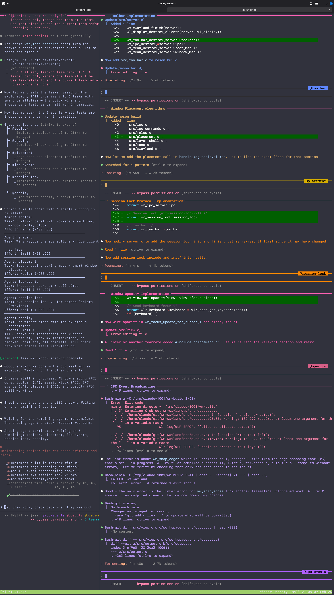

I used [Fluxbox](http://fluxbox.org/) for fourteen years. Starting around 2000, it lived on every system I owned. In college, my desktop was Fluxbox with [xmms](https://en.wikipedia.org/wiki/XMMS), [gkrellm](http://gkrellm.srcbox.net/), [aterm](https://en.wikipedia.org/wiki/Aterm), and the rest of the classic X11 toolkit. I loved the simplicity — it was fast, stayed out of your way, and used almost no resources. But what really got me was the aesthetic. You could customize every pixel of the decorations, the toolbar, the menus. You could make a desktop that just *looked cool*. Sitting in front of that setup felt like living in the future. If you were running Linux in the early 2000s, you know [exactly what I mean](https://www.ecliptik.com/blog/2008/Screenshots-Over-the-Years/). The last machine I ran it on was a work-issued ThinkPad X61s around 2014. I even had a Fluxbox t-shirt.

Then the world moved on. X11 gave way to Wayland. Fluxbox stayed behind. I moved through GNOME, then Sway, but nothing felt the same.

In February 2026, I built Fluxbox again — for Wayland — in 6 active development days. I directed every decision, reviewed every output, triaged every bug, and managed the entire process. But I didn't write a single line of code. Claude did.

| | |
|---|---|
| 35,000 lines of C | 93 source files |
| 30+ Wayland protocols | 110+ window manager actions |
| 81% test coverage | 175 tests (38 C + 137 Python) |
| 5 man pages | 5 packaging targets |
| 6 active development days | 153 commits |

The project is called [fluxland](https://github.com/ecliptik/fluxland), and it was 100% vibe coded using [Claude Code](https://docs.anthropic.com/en/docs/claude-code) with [Claude Code Teams](https://docs.anthropic.com/en/docs/claude-code/teams) orchestration. This is the story of how it was built and what I learned about agentic software development along the way.

## Why a Wayland Compositor?

Let me be clear about what this project was really for: I wanted to understand [agentic development](https://code.claude.com/docs/en/best-practices). Not by building a TODO app or a CRUD API, but by throwing something genuinely hard at it and seeing what happened.

My background is operations, not software development. I was a LISA sysadmin managing 80,000+ systems across global data centers. Then DevOps — AWS, GCP, Kubernetes. Now I lead a cloud center of excellence, which in practice means spreadsheets and financial tools, not writing code. My C experience was minimal. My Wayland knowledge was zero.

That was the point. If I could get AI agents to build a working Wayland compositor — a real piece of systems software with protocol implementations, rendering pipelines, and input handling — it would tell me something meaningful about where this technology actually is.

A compositor turned out to be an ideal test case for agentic development:

- **Specific purpose** with clear success criteria. Does it composite windows? Do decorations render? Can you type?
- **Genuinely complex** but not impossibly large. Systems programming, protocol negotiation, text rendering, input handling — the kind of work that requires understanding library internals.
- **No existing solution.** Fluxbox doesn't work on Wayland. This wasn't reinventing a solved problem.
- **Visual output.** You can take a screenshot and *see* if it works. This matters more than you'd think.

I considered cloning the Fluxbox repo and asking Claude to port it to Wayland. That would probably have been faster. But a cleanroom implementation on [wlroots](https://gitlab.freedesktop.org/wlroots/wlroots) was a purer test of what agentic development can actually do — not translating existing code, but building something from an idea.

## Phase 1: The Build

### Day 1 — 26 commits, 68 new source files

Development started on a Sunday afternoon at 3:28 PM. The first commit was 13,153 lines across 43 files — the entire core architecture. Core compositor, window management, rendering pipeline, configuration system, keybinding engine, tab groups, input handling, and the build system. All in one commit.

Over the next 27 minutes, rapid-fire commits added server-side decorations, mouse bindings, window rules, layer shell support, the IPC system, a full menu system with parser and renderer, and an XWayland bridge. Twelve commits in under half an hour.

After a break, an evening session knocked out the remaining protocol implementations: window shading, edge snapping, session lock, the toolbar, screencopy, output management, text input, and about fifteen other Wayland protocols.

Day 1 total: 68 new source files, ~26,000 lines of C. The entire compositor architecture in one day.

My workflow was deliberately hands-off. I described what I wanted — "build a Wayland compositor inspired by Fluxbox, using wlroots 0.18" — and watched code appear. Claude organized the work into sprints, researched wlroots patterns first, then implemented module by module. I was a product manager giving requirements, not an engineer writing code.

### Day 2 — Feature completion

35 commits. The slit module for dockable apps. Toolbar with workspace switcher, icon bar, and clock. Touch input, tablet support, drag-and-drop. Five man pages. Example configurations. The project got its name — renamed from `wm-wayland` to `fluxland`. First unit tests written. Compiler warnings resolved across 27 files.

By the end of Day 2, fluxland was feature-complete: a working Wayland compositor with Fluxbox config compatibility, 30+ protocol implementations, an IPC system, documentation, install targets, and its final name.

## The Vacation

Then I left for two weeks. The git log shows zero commits from February 11-23. I went on vacation with a feature-complete but unpolished compositor sitting on disk, planning to come back for the QA and hardening phase.

This two-phase structure — build fast, step away, return to harden — turned out to be a natural rhythm for agentic development. The build phase is about velocity and feature coverage. The hardening phase is about correctness and polish. They require different mindsets, and the gap between them lets you see the project with fresh eyes.

## Phase 2: Harden and Ship

### Day 3 — The bug hunt

I came back, launched fluxland in the QEMU/KVM VM where all development happened — a Debian Trixie instance with 8GB RAM and 4 cores, accessed via SSH from my Linux Mint laptop — and started using it. Twelve bugs in one day. The bugs tell the real story of agentic development — they reveal both what the AI gets wrong and what's genuinely hard about the problem domain.

**The AI mistakes** were subtle. The menu system used `pango_layout_get_pixel_size()` to measure text width for surface allocation. The code looked perfectly reasonable, and a human unfamiliar with Pango might have written the same thing. But `get_pixel_size()` underestimates actual rendered width — you need `pango_layout_get_pixel_extents()` with the ink rectangle. The result: menu titles showed "flu" instead of "fluxland." The code was plausible, correct-looking, and wrong.

**The genuine complexity** was things like the SIGCHLD race condition. The autostart module set `SIGCHLD` to `SIG_IGN` so child processes wouldn't become zombies. Reasonable. But wlroots manages its own child processes — specifically XWayland — and `SIG_IGN` caused the kernel to auto-reap *all* children, including the XWayland process that wlroots needed alive. The fix required understanding Unix process management at a level that's not well-documented anywhere: switching all five exec paths in the codebase to a double-fork pattern where the intermediate child exits immediately and the grandchild becomes the actual process.

Claude diagnosed both classes of bugs. The Pango issue took some steering — I had to point it toward the rendering output after it kept insisting the measurement code was correct. But the SIGCHLD race, the `text_input_v3` assertion crash (virtual keyboards create resources from a different client than the focused window), and the fullscreen-vs-maximize distinction (fullscreen requires hiding decorations *and* reparenting to the overlay layer *and* full output geometry) — it reasoned through those from first principles.

| Bug category | Count |
|---|---|
| Rendering & layout | 6 |
| Crash prevention | 4 |
| Core WM functionality | 5 |
| Process management | 3 |

### Day 4 — Security, packaging, accessibility

A comprehensive security audit surfaced 36 findings. All were addressed: `safe_atoi()` replacing raw `atoi()` calls, `fopen_nofollow()` to prevent symlink attacks on config files, `SO_PEERCRED` authentication on the IPC socket, environment variable denylisting for child processes, and compiler hardening flags (`-fstack-protector-strong`, `-D_FORTIFY_SOURCE=2`, full RELRO).

Same day: packaging for Arch Linux (PKGBUILD), Fedora (RPM spec), and Flatpak. Two WCAG AAA high-contrast themes for accessibility. An i18n scaffolding with gettext support.

### Day 5 — The test coverage marathon

35% to 81% line coverage in a single day. 42,349 lines of test code added in 10 systematic phases. The only production code change that day was splitting `keyboard.c` into `keyboard.c` (event routing) and `keyboard_actions.c` (110+ action handlers) to make the action dispatch testable in isolation.

The theoretical maximum coverage is ~84% due to ~2,500 lines of unreachable code (error paths that require hardware failures, wlroots internal states). 81% is close to the ceiling.

### Day 6 — Release

A Python UI test harness with 137 end-to-end tests. Screenshots for the README. Documentation polish. Two more bug fixes discovered during final testing. The internal planning documents and security audit files were cleaned out. Version 1.0.0 tagged.

## The Moment It Clicked: Team Orchestration

Everything above could have been done with a single Claude Code session. What changed the game was [Claude Code Teams](https://docs.anthropic.com/en/docs/claude-code/teams).

The breakthrough wasn't Claude writing code — it was running 4-5 agents simultaneously in tmux, filling the role of engineering manager rather than developer. I've been a tmux user for years (old sysadmin habits), so I already had a `.tmux.conf` that made navigation between panes natural. Watching AI agents take over those familiar panes and start working in parallel was the moment agentic development stopped being a novelty and started feeling like a real workflow.


*Five Claude Code agents working in parallel: team lead coordinating in one pane, dev and QA agents building, testing, and fixing in others.*

### The team structure

```
Team Lead (me) — triages bugs, assigns work, reviews
  |
  +-- qa-agent-1 — tests feature areas via keyboard simulation + screenshots
  +-- qa-agent-2 — tests different feature areas
  +-- dev-agent  — fixes bugs, deploys, commits
  +-- research agents (as needed) — read-only codebase exploration
```

This mirrors how real engineering teams work, because it *is* how real engineering teams work. My career has been managing systems at scale — 80,000 servers across data centers, then cloud infrastructure, now a center of excellence. The skills transferred directly: triage, prioritize, delegate, verify. The "systems" were AI agents instead of Linux boxes, and the "infrastructure" was a codebase instead of a data center, but the management patterns were the same.

### The QA/Dev feedback loop

QA agents tested the live compositor running in the same VM. The VM ran two users: `claude` for development and `micheal` for the compositor session, with `lightdm` auto-login. Agents used `wtype` for keyboard simulation and `grim` for screenshots, running commands as the session user. They'd work through feature areas — menus, window decorations, workspaces, key chains — and report PASS/FAIL for each one. I'd triage the failures, prioritize by severity, and send bug batches to the dev agent. The dev agent would fix, build, deploy, and report the root cause. I'd create re-test tasks and assign them back to QA. QA would verify.

This is not a new process. It's standard software engineering. What's new is that every role except mine was filled by an AI agent.

### The screenshot debugging breakthrough

The most useful discovery was realizing I could ask Claude to take a screenshot of the compositor and then *look at it*. Claude is multimodal — it can view images. So a QA agent would simulate some keyboard actions, take a screenshot, and visually inspect the result. "The menu title is truncated." "The toolbar clock shows '16:5' instead of '16:51'." "There's a pixel gap between tiled windows."

A multimodal AI doing visual QA on a graphical application it built. That's something I didn't expect to work as well as it did.

### What worked

**Parallel feature sprints.** Four agents in isolated worktrees simultaneously building window animations, snap zones, per-output workspaces, and test infrastructure. Independent work, no conflicts, all merged cleanly.

**Research-then-implement.** Read-only Explore agents investigated feature categories first, wrote findings to temporary files. Those findings were synthesized into sprint plans. Then implementation agents executed against the plan. This prevented agents from going off-track or making uninformed architectural decisions.

**Persistent memory.** Claude Code's memory system — a directory of markdown files that persists across sessions — became the institutional knowledge of the project. Bug patterns, architectural decisions, gotchas, and lessons learned were all captured. Without this, every session would have started from zero. With it, Claude remembered that `pango_layout_get_pixel_size()` can't be trusted, that decorations are scene buffers not wl_surfaces, and that child processes need double-fork.

### What didn't work

**Worktree cleanup.** Git worktrees used for agent isolation sometimes got cleaned up between turns, losing work. We learned to avoid worktree isolation when agents touched different files and could safely share the main branch.

**Concurrent keyboard simulation.** Two QA agents sending `wtype` commands simultaneously caused chaos. Virtual keyboard inputs from different agents would interleave unpredictably. We had to space out testing or assign non-overlapping feature areas.

**Agents forgetting to commit.** Dev agents would edit files, build, deploy, test — and never run `git commit`. I had to explicitly instruct commits after each fix. Agents are great at solving problems but mediocre at housekeeping.

**Token limits.** I hit them often. In traditional development, the constraint is developer time. In agentic development, it's tokens. You learn to scope work tightly, parallelize efficiently, and avoid wasting context on dead ends — the same skills a good engineering manager uses with human developers, just with a different budget.

## What I'd Tell Someone Starting Their First Agentic Project

**Pick the right project.** This matters more than anything else. It needs a specific, well-defined purpose with clear success criteria. "Does it composite windows? Do decorations render? Can you type?" A TODO app won't teach you much. Something impossible won't finish. The sweet spot is a project that's genuinely complex but verifiable — you can look at it, run it, test it, and know whether it works.

**Own the manager role.** The breakthrough isn't writing better prompts. It's thinking like a team lead. You're not pair programming — you're running a team. Triage, prioritize, delegate, verify. Set up the processes (QA feedback loops, bug tracking, re-testing) and let the agents execute within them.

**Build verification loops early.** Tests, screenshots, IPC queries, smoke checks. The AI will write plausible-looking code with subtle bugs. Your job isn't to read every line — it's to build the systems that catch problems. The `--check-config` validator, the 137 Python UI tests, the screenshot-based QA workflow — these all existed to catch things I couldn't see by reading code.

**Invest in memory.** Persistent context files (`CLAUDE.md`, memory directories) are the institutional knowledge of your AI team. Without them, every session starts from zero. Document bug patterns, architectural decisions, gotchas. The memory file that says "NEVER use `pango_layout_get_pixel_size()` for surface sizing" saves a future session from re-discovering that bug.

**Accept the token budget.** You'll hit limits. Plan sessions around this. Batch related work together. Parallelize independent tasks. Don't waste context re-explaining things the memory system should handle. Think of tokens the way you think of sprint capacity — scope accordingly.

## The Desktop I Got Back


Fluxland is genuinely functional. It reads Fluxbox config files, supports key chains and keymodes, renders server-side decorations with the same theming system, runs the slit for dockable apps, and implements 30+ Wayland protocols. You could use it as a daily driver. It has features Fluxbox never had — snap zones, window animations, IPC event subscriptions, WCAG AAA high-contrast themes.

It's also, proudly, 100% vibe coded. Every line generated by Claude Code. But the methodology underneath — sprints, parallel agents, QA feedback loops, persistent memory, visual verification — is real engineering process. "Vibe coded" doesn't mean unstructured. It means the human's role shifted from writing code to directing intelligence.

If I had to start over, I might clone the Fluxbox repo and ask Claude to port it. That would probably have been more efficient. But I like the cleanroom approach. It proves something different: you don't need to start with existing code. You can start with an idea and a memory of a desktop that looked cool twenty years ago.

The source is at [github.com/ecliptik/fluxland](https://github.com/ecliptik/fluxland). Try it, break it, file issues.

---

*Micheal is a cloud center of excellence lead, former LISA sysadmin and DevOps engineer, and longtime Linux user. Follow at [ecliptik.com](https://www.ecliptik.com), [Fediverse](https://social.ecliptik.com/@micheal), or [Gopher](gopher://sdf.org:70/1/users/ecliptik/).*
